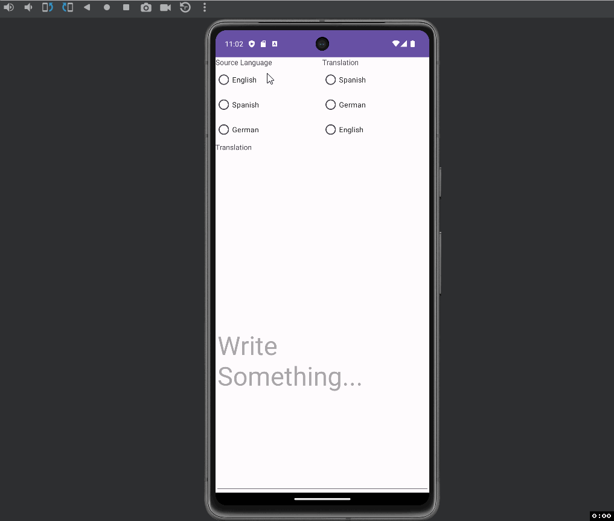
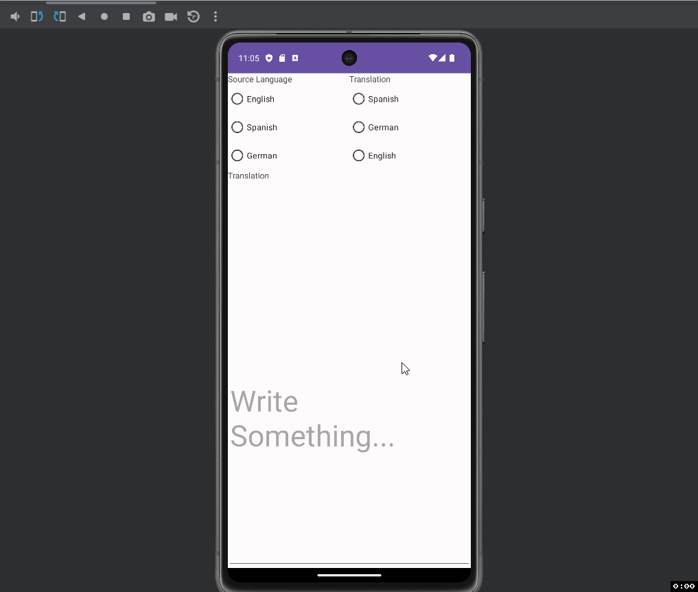

Translation Application

Description of the project ...

- The project is an application that is created to Translation Languages to Languages.

## Functionality 

The following **required** functionality is completed:

* [ ] UI should be set up properly
* [ ] View Binding and View Model is implemented correctly and is responsible for communication between activity and the fragment.
* [ ] ML Kit is correctly configured and used for translation.
* [ ] App behaves in the manner that is described. This includes the functionality such as implementing text change listener, initializing the view model, etc.
* [ ] ...

The following **extensions** are implemented:

* No Extensions were used. Everything was from Kotlin

* Implementation of Auto Detect Feature. Extra 10 marks will be awarded .

## Video Walkthrough

Here's a walkthrough of implemented user stories:

Walkthrough 1 Shows What happens when no radio buttons are selected and user inputs something. 
It then Shows what happens when the Source Buttons are selected first and then what happens when both Source and Tranlation options are selected.

GIF created with [LiceCap](http://www.cockos.com/licecap/).

Walkthrough 2 Will show Auto Source Language Selection based on User Input. Although Translation Option has to be selected for this to work properly.

GIF created with [LiceCap](http://www.cockos.com/licecap/).

## Notes

Describe any challenges encountered while building the app.

- Setting up View Model, View Binding, and Auto Translation was somewhat challenging.

## License

    Copyright [yyyy] [name of copyright owner]

    Licensed under the Apache License, Version 2.0 (the "License");
    you may not use this file except in compliance with the License.
    You may obtain a copy of the License at

        http://www.apache.org/licenses/LICENSE-2.0

    Unless required by applicable law or agreed to in writing, software
    distributed under the License is distributed on an "AS IS" BASIS,
    WITHOUT WARRANTIES OR CONDITIONS OF ANY KIND, either express or implied.
    See the License for the specific language governing permissions and
    limitations under the License.
